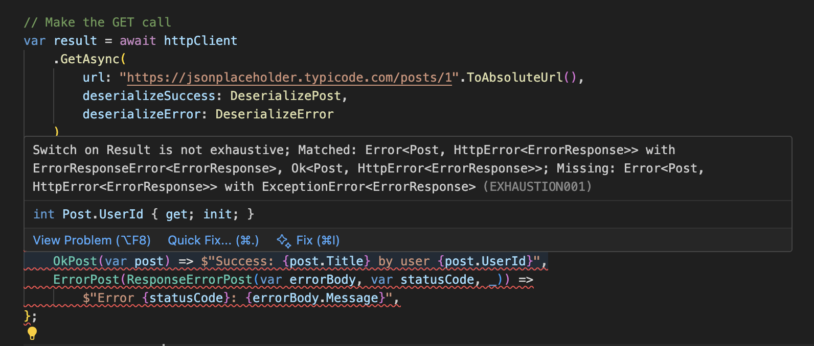

# RestClient.Net

 

**The safest way to make REST calls in C#**

Built from the ground up with functional programming, type safety, and modern .NET patterns. Successor to the [original RestClient.Net](https://www.nuget.org/packages/RestClient.Net.Abstractions).

## What Makes It Different

This library is uncompromising in its approach to type safety and functional design:
- **HttpClient extensions** - Works with [HttpClient lifecycle management](https://learn.microsoft.com/en-us/dotnet/fundamentals/networking/http/httpclient-guidelines#recommended-use) via `IHttpClientFactory.CreateClient()`
- **Result types** - Explicit error handling without exceptions
- **Exhaustiveness checking** - Compile-time guarantees via [Exhaustion](https://www.nuget.org/packages/Exhaustion)
- **Functional composition** - Pure functions with no interfaces

## Features

- **Result Types** - Returns `Result<TSuccess, HttpError<TError>>` with closed hierarchy types for compile-time safety (Outcome package)
- **Zero Exceptions** - No exception throwing for predictable error handling
- **Progress Reporting** - Built-in download/upload progress tracking
- **Polly Integration** - Support for convention-based [retry policies and resilience patterns](https://learn.microsoft.com/en-us/dotnet/fundamentals/networking/http/httpclient-guidelines#resilience-with-static-clients)
- **Async/Await Only** - Modern async patterns throughout
- **HttpClient Extensions** - Works with `IHttpClientFactory.CreateClient()` for proper [pooled connections](https://learn.microsoft.com/en-us/dotnet/fundamentals/networking/http/httpclient-guidelines#pooled-connections) and [DNS behavior](https://learn.microsoft.com/en-us/dotnet/fundamentals/networking/http/httpclient-guidelines#dns-behavior) handling
- **Exhaustiveness Checking** - Uses [Exhaustion](https://github.com/MelbourneDeveloper/Exhaustion) for compile-time completeness guarantees (stopgap until C# adds discriminated unions)

The design focuses on [discriminated unions](https://github.com/dotnet/csharplang/issues/8928) for results, and adding the [Exhaustion analyzer](https://www.nuget.org/packages/Exhaustion) package gives you exhaustive pattern matching on type in C#. RestClient.Net is well ahead of the game. You can use discriminated unions with exhaustiveness checks in C# right now.

## Installation

Install the core package:
```bash
dotnet add package RestClient.Net
```

RestClient.Net installs the Exhaustion analyzer. Is is a Roslyn analyzer that provides compile-time exhaustiveness checking for pattern matching. Without it, you lose one of RestClient.Net's core safety guarantees.

## Usage

### Basic GET Request

A complete example making a GET request to JSONPlaceholder:

```csharp
using System.Text.Json;
using RestClient.Net;
using Urls;

// Define models
internal sealed record Post(int UserId, int Id, string Title, string Body);
internal sealed record ErrorResponse(string Message);

// Create HttpClient (use IHttpClientFactory in production)
using var httpClient = new HttpClient();

// Make the GET call
var result = await httpClient
    .GetAsync(
        url: "https://jsonplaceholder.typicode.com/posts/1".ToAbsoluteUrl(),
        deserializeSuccess: DeserializePost,
        deserializeError: DeserializeError
    )
    .ConfigureAwait(false);

// Pattern match on the result - MUST handle all cases
var output = result switch
{
    OkPost(var post) =>
        $"Success: {post.Title} by user {post.UserId}",
    ErrorPost(ResponseErrorPost(var errorBody, var statusCode, _)) =>
        $"Error {statusCode}: {errorBody.Message}",
    ErrorPost(ExceptionErrorPost(var exception)) =>
        $"Exception: {exception.Message}",
};

Console.WriteLine(output);

async Task<Post?> DeserializePost(HttpResponseMessage response, CancellationToken ct) =>
    await JsonSerializer
        .DeserializeAsync<Post>(
            await response.Content.ReadAsStreamAsync(ct).ConfigureAwait(false),
            new JsonSerializerOptions { PropertyNameCaseInsensitive = true },
            cancellationToken: ct
        )
        .ConfigureAwait(false);

async Task<ErrorResponse?> DeserializeError(HttpResponseMessage response, CancellationToken ct) =>
    await JsonSerializer
        .DeserializeAsync<ErrorResponse>(
            await response.Content.ReadAsStreamAsync(ct).ConfigureAwait(false),
            new JsonSerializerOptions { PropertyNameCaseInsensitive = true },
            cancellationToken: ct
        )
        .ConfigureAwait(false);
```

### Result Type and Type Aliases

C# doesn't officially support discriminated unions, but you can achieve closed type hierarchies with the [sealed modifier](https://learn.microsoft.com/en-us/dotnet/csharp/language-reference/keywords/sealed). The [Outcome package](https://www.nuget.org/packages/Outcome/) gives you a set of Result types designed for exhaustiveness checks. Until C# gains full discriminated union support, you need to add type aliases like this:

```cs
// Type aliases for concise pattern matching (usually in GlobalUsings.cs)
global using OkPost = Outcome.Result<Post, Outcome.HttpError<ErrorResponse>>.Ok<Post, Outcome.HttpError<ErrorResponse>>;
global using ErrorPost = Outcome.Result<Post, Outcome.HttpError<ErrorResponse>>.Error<Post, Outcome.HttpError<ErrorResponse>>;
global using ResponseErrorPost = Outcome.HttpError<ErrorResponse>.ErrorResponseError;
global using ExceptionErrorPost = Outcome.HttpError<ErrorResponse>.ExceptionError;
```

If you use the OpenAPI generator, it will generate these type aliases for you automatically.

## Exhaustiveness Checking with Exhaustion

**Exhaustion is integral to RestClient.Net's safety guarantees.** It's a Roslyn analyzer that ensures you handle every possible case when pattern matching on Result types.

### What Happens Without Exhaustion

If you remove a switch arm and don't have Exhaustion installed, the code compiles but may crash at runtime:

```csharp
// DANGEROUS - compiles but may throw at runtime
var output = result switch
{
    OkPost(var post) => $"Success: {post.Title}",
    ErrorPost(ResponseErrorPost(var errorBody, var statusCode, _)) =>
        $"Error {statusCode}: {errorBody.Message}",
    // Missing ExceptionErrorPost case - will throw at runtime if an exception occurs!
};
```

### What Happens With Exhaustion

With Exhaustion installed, the compiler **catches this at build time**:

```
error EXHAUSTION001: Switch on Result is not exhaustive;
Matched: Ok<Post, HttpError<ErrorResponse>>, Error<Post, HttpError<ErrorResponse>> with ErrorResponseError<ErrorResponse>
Missing: Error<Post, HttpError<ErrorResponse>> with ExceptionError<ErrorResponse>
```

 

Your build fails until you handle all cases. This is the difference between **runtime crashes** and **compile-time safety**.

### Installing Exhaustion Without RestClient.Net

Add it to your project:
```bash
dotnet add package Exhaustion
```

Exhaustion works by analyzing sealed type hierarchies in switch expressions and statements. When you match on a `Result<TSuccess, HttpError<TError>>`, it knows there are exactly three possible cases:
- `Ok<TSuccess, HttpError<TError>>` - Success case
- `Error<TSuccess, HttpError<TError>>` with `ErrorResponseError<TError>` - HTTP error response
- `Error<TSuccess, HttpError<TError>>` with `ExceptionError<TError>` - Exception during request

If you don't handle all three, your code won't compile.

### OpenAPI Code Generation

Generate type-safe extension methods from OpenAPI specs:

```csharp
using JSONPlaceholder.Generated;

// Get HttpClient from factory
var httpClient = factory.CreateClient();

// GET all todos
var todos = await httpClient.GetTodos(ct);

// GET todo by ID
var todo = await httpClient.GetTodoById(1, ct);
switch (todo)
{
    case OkTodo(var success):
        Console.WriteLine($"Todo: {success.Title}");
        break;
    case ErrorTodo(var error):
        Console.WriteLine($"Error: {error.StatusCode} - {error.Body}");
        break;
}

// POST - create a new todo
var newTodo = new TodoInput { Title = "New Task", UserId = 1, Completed = false };
var created = await httpClient.CreateTodo(newTodo, ct);

// PUT - update with path param and body
var updated = await httpClient.UpdateTodo((Params: 1, Body: newTodo), ct);

// DELETE - returns Unit
var deleted = await httpClient.DeleteTodo(1, ct);
```

```bash
dotnet add package RestClient.Net.OpenApiGenerator
```

Define your schema (OpenAPI 3.x):
```yaml
openapi: 3.0.0
paths:
  /users/{id}:
    get:
      operationId: getUserById
      parameters:
        - name: id
          in: path
          required: true
          schema:
            type: string
      responses:
        '200':
          content:
            application/json:
              schema:
                $ref: '#/components/schemas/User'
  /users:
    post:
      operationId: createUser
      requestBody:
        content:
          application/json:
            schema:
              $ref: '#/components/schemas/User'
      responses:
        '201':
          content:
            application/json:
              schema:
                $ref: '#/components/schemas/User'
```

The generator creates:
1. **Extension methods** - Strongly-typed methods on `HttpClient`
2. **Model classes** - DTOs from schema definitions
3. **Result type aliases** - Convenient `OkUser` and `ErrorUser` types

Generated usage:
```csharp
// Get HttpClient from factory
var httpClient = factory.CreateClient();

// GET with path parameter
var user = await httpClient.GetUserById("123", ct);

// POST with body
var created = await httpClient.CreateUser(newUser, ct);

// PUT with path param and body
var updated = await httpClient.UpdateUser((Params: "123", Body: user), ct);

// DELETE returns Unit
var deleted = await httpClient.DeleteUser("123", ct);
```

All generated methods:
- Create extension methods on `HttpClient` (use with `IHttpClientFactory.CreateClient()`)
- Return `Result<TSuccess, HttpError<TError>>` for functional error handling
- Bundle URL/body/headers into `HttpRequestParts` via `buildRequest`
- Support progress reporting through `ProgressReportingHttpContent`

### Progress Reporting

You can track upload progress with `ProgressReportingHttpContent`. This example writes to the console when there is a progress report.

```csharp
var fileBytes = await File.ReadAllBytesAsync("document.pdf");

using var content = new ProgressReportingHttpContent(
    fileBytes,
    progress: (current, total) =>
        Console.WriteLine($"Progress: {current}/{total} bytes ({current * 100 / total}%)")
);

var httpClient = httpClientFactory.CreateClient();
var result = await httpClient.PostAsync<UploadResponse, string>(
    url: "https://api.example.com/upload".ToAbsoluteUrl(),
    requestBody: content,
    deserializeSuccess: (r, ct) => r.Content.ReadFromJsonAsync<UploadResponse>(ct),
    deserializeError: (r, ct) => r.Content.ReadAsStringAsync(ct)
);
```

## Mocking with Delegating Handlers for Tests

Mock HTTP calls by inheriting from `DelegatingHandler` and overriding `SendAsync` ([see Microsoft docs](https://learn.microsoft.com/en-us/aspnet/web-api/overview/advanced/httpclient-message-handlers)):

```csharp
class MockHandler : DelegatingHandler
{
    protected override Task<HttpResponseMessage> SendAsync(
        HttpRequestMessage request, CancellationToken cancellationToken)
    {
        var response = (request.Method.Method, request.RequestUri?.PathAndQuery) switch
        {
            ("GET", "/posts/1") => new HttpResponseMessage(HttpStatusCode.OK)
            {
                Content = JsonContent.Create(new Post(1, 1, "Title", "Body"))
            },
            ("POST", "/posts") => new HttpResponseMessage(HttpStatusCode.Created)
            {
                Content = JsonContent.Create(new { Id = 101 })
            },
            _ => new HttpResponseMessage(HttpStatusCode.NotFound)
        };

        return Task.FromResult(response);
    }
}

// Create HttpClient with mock handler
var httpClient = new HttpClient(new MockHandler());

// Make calls - they hit the mock handler
var result = await httpClient.GetAsync(
    url: "https://api.example.com/posts/1".ToAbsoluteUrl(),
    deserializeSuccess: DeserializePost,
    deserializeError: DeserializeError
);

// Result contains mocked data
result switch
{
    OkPost(var post) => Console.WriteLine($"Got mocked post: {post.Title}"),
    ErrorPost(var error) => Console.WriteLine($"Error: {error.StatusCode}")
};
```

## Upgrading from RestClient.Net 6.x

You can continue to use the V6 `IClient` interface with RestClient .Net 7. RestClient.Net 7 is a complete rewrite with a functional architecture. For existing v6 users, **RestClient.Net.Original** provides a polyfill that implements the v6 `IClient` interface using v7 under the hood.

### Using the Polyfill

Install both packages:
```bash
dotnet add package RestClient.Net.Original
dotnet add package RestClient.Net.Abstractions --version 6.0.0
```

Use `Client` to maintain v6 compatibility while benefiting from v7's improvements:
```csharp
using RestClient.Net;

var client = new Client(
    httpClientFactory,
    baseUrl: "https://api.example.com".ToAbsoluteUrl(),
    defaultRequestHeaders: new HeadersCollection(),
    throwExceptionOnFailure: true
);

// Continue using your existing v6 IClient extension methods
var user = await client.GetAsync<User>("users/123");
var created = await client.PostAsync<User, CreateUserRequest>(newUser, "users");
var updated = await client.PutAsync<User, UpdateUserRequest>(updateUser, "users/123");
var deleted = await client.DeleteAsync("users/123");
```

This approach allows gradual migration. You can keep your existing implementations working while incrementally adopting v7's functional patterns.
